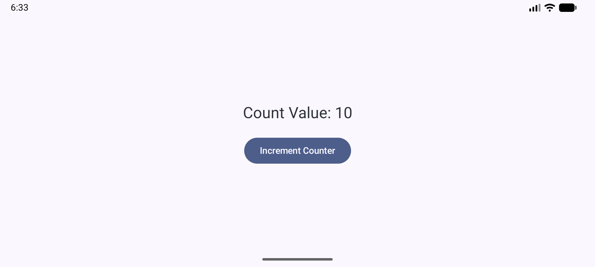

# CS501midterm_Q2
# Question 2: ViewModel + Unidirectional Data Flow

## Description

This task refactors a simple counter application to follow proper Android architecture using a ViewModel and unidirectional data flow. Instead of managing state inside the composable, the state is moved to a ViewModel to improve separation of concerns and lifecycle handling.

---

## Screenshot



This screenshot demonstrates that the counter value is preserved after screen rotation, confirming proper state management using a ViewModel.

---

## Implementation Details

### ViewModel

* A `CounterViewModel` is created to manage the counter state
* The counter value is stored inside the ViewModel
* A function `increment()` is defined to update the state

### Composable (`CounterScreen`)

* The composable reads state directly from the ViewModel:

  ```kotlin
  val count by viewModel.count
  ```
* The UI displays the current count value
* Button clicks call the ViewModel function:

  ```kotlin
  viewModel.increment()
  ```

---

## Unidirectional Data Flow

This implementation follows unidirectional data flow:

1. **State** is stored in the ViewModel
2. **UI reads** the state from the ViewModel
3. **User actions** (button clicks) trigger ViewModel functions
4. **State updates** in the ViewModel automatically trigger recomposition

---

## Recomposition Behavior

* When the state inside the ViewModel changes:

  * The composable observes the updated state
  * Jetpack Compose automatically recomposes the UI
  * The updated count is displayed instantly

---

## Key Features Implemented

* State managed inside a ViewModel
* Clear separation between UI and business logic
* Button interactions handled through ViewModel functions
* Automatic UI updates via recomposition
* State survives configuration changes (e.g., screen rotation)
* Proper implementation of unidirectional data flow

---

## Conclusion

This implementation demonstrates how to structure a Compose application using ViewModel and unidirectional data flow. It improves scalability, maintainability, and lifecycle awareness compared to managing state directly in the composable.

---

## AI Usage Disclosure

* **Tool Used:** ChatGPT
* **How it was used:** Assisted in writing and structuring the README, and helped identify and fix small bugs/issues during development
* **Extent of Use:** AI was used only for support purposes; all core implementation and problem-solving were completed independently

---
